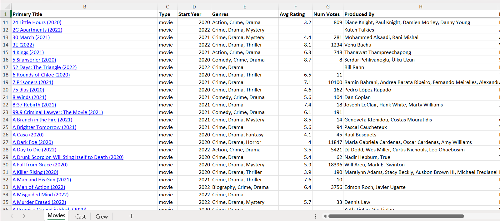
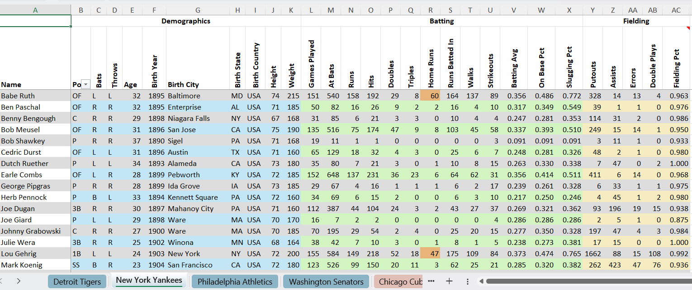

# Examples

Runnable scripts that demonstrate dbtk features end-to-end. Each file is
self-contained and includes setup instructions in its module docstring.

---

## [`linked_spreadsheet.py`](linked_spreadsheet.py)

Creates a navigable multi-sheet Excel workbook using `LinkedExcelWriter`.

**Demonstrates:**
- Multiple sheets (Movies, Cast, Crew)
- External hyperlinks to IMDB movie and person pages
- Internal cross-sheet hyperlinks from Cast/Crew back to the Movies tab
- `external_only` `LinkSource` reused across sheets
- `PreparedStatement` for parameterized queries
- Batch writing across sheets

**Requires:** `openpyxl`, a database connection with the IMDB subset loaded
(see `data_load_imdb_subset.py`)

---

## [`formatted_spreadsheet.py`](formatted_spreadsheet.py)

Creates a multi-sheet Excel workbook with rich formatting using `ExcelWriter` —
one sheet per team for the top 4 finishers from each league in the 1927 season.

**Demonstrates:**
- Multi-sheet workbook from a single `ExcelWriter` instance
- Named styles applied to column ranges (`group_label`) and alternating row stripes
- Merged group-header row labelling the Demographics, Batting, and Fielding sections
- Auto-rotating long headers over narrow stat columns (`header_auto_rotate`)
- Conditional per-cell styling via a `style` callable (Home Runs ≥ 15 highlighted)
- Overlapping column rules that compose rather than override (range background + number format)
- Column comment on the header cell
- Hidden column (`team_name` carried in data for filtering but not shown in the sheet)
- `headers=` mapping underscore field names to space-separated display labels

**Requires:** `openpyxl`, `polars` — `output/1927_baseball.parquet` is included in
the repo so you can run this directly. `prep_1927_data.py` is provided if you want
to rebuild it from the
[Lahman Baseball Database](https://github.com/chadwickbureau/baseballdatabank/archive/refs/heads/master.zip).

---

## [`data_load_imdb_subset.py`](data_load_imdb_subset.py)

ETL pipeline that builds a referentially-intact subset of the IMDB dataset
(~1,000 movies with matching cast, crew, and ratings) using `DataSurge`.

**Demonstrates:**
- Filtering 11M+ title records down to a focused subset
- `DataSurge` for upsert-based loading with error tracking
- `ValidationCollector` for capturing and reporting data quality issues
- `TableLookup` transforms for foreign-key resolution
- Reading `.tsv.gz` files with `DataFrameReader`

**Requires:** [IMDB non-commercial datasets](https://developer.imdb.com/non-commercial-datasets/),
a supported database connection

---

## [`bulk_load_imdb_subset_pg.py`](bulk_load_imdb_subset_pg.py)

High-performance variant of the IMDB loader using `BulkSurge` (Postgres
`COPY FROM`) to load ~16,000 movies and all related records.

**Demonstrates:**
- `BulkSurge` for maximum throughput on large datasets
- Filtering and joining across multiple large TSV files
- Referential integrity across titles, people, and ratings tables

**Requires:** PostgreSQL, [IMDB non-commercial datasets](https://developer.imdb.com/non-commercial-datasets/)

---

## [`bulk_load_titles.py`](bulk_load_titles.py)

Standalone example loading `title.basics.tsv.gz` (12M+ records) into
Postgres using `BulkSurge` and a `DataFrameReader` backed by Polars.

**Demonstrates:**
- `BulkSurge` with Postgres `COPY FROM CSV`
- `TableLookup` to normalize a genres array into a lookup table
- `DataFrameReader` wrapping a Polars DataFrame

**Requires:** PostgreSQL, Polars, `title.basics.tsv.gz` from IMDB

---

## [`data_load_names.py`](data_load_names.py)

Loads the first 100,000 rows of `name.basics.tsv.gz` (14M+ records total)
into Postgres, normalizing professions into a lookup table.

**Demonstrates:**
- Partial dataset loading with row limits
- Array column handling for Postgres
- `TableLookup` for profession normalization

**Requires:** PostgreSQL, Polars, `name.basics.tsv.gz` from IMDB
